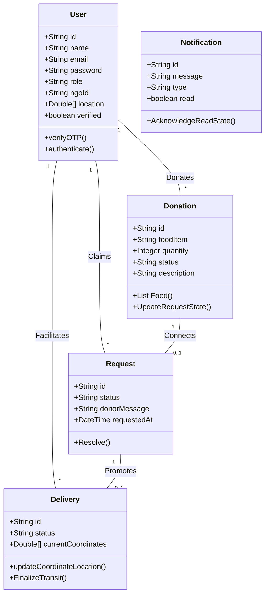
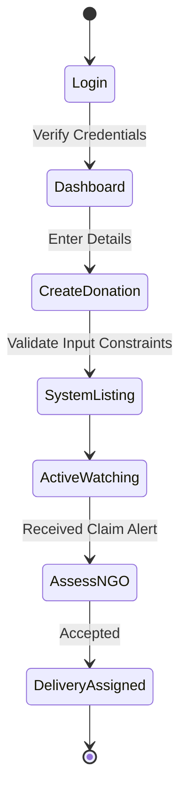
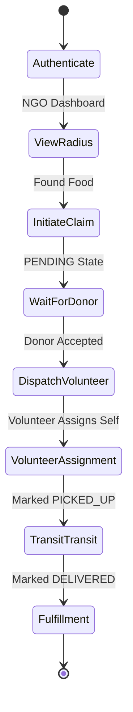

<div align="center">

# PROJECT REPORT
**On**
# “FOOD RESCUE PLATFORM”

## ACKNOWLEDGEMENT

It is with immense gratitude that we present this project report titled "Food Rescue Platform," which marks a significant milestone in my academic journey in the field of Master of Computer Applications.

Team Effort is the only key to success. Success cannot be achieved single-handedly. So, we would like to express our sincere thanks to all the dignitaries involved in making this project a great joy and turning it into a successful work.

We would like to take the opportunity to thank my college Sarvajanik College of Engineering and Technology for giving us this tremendous opportunity to work in the real-time project.

Prof. (Dr.) Kaushika Pal our professor and project coordinator has been very prudent to us throughout our college studies. He is the person who has been giving direction to our work and the shape of our imagination.

We also like to thank our H.O.D. Prof. Gayatri Kapadia and all the professors who are always ready to give best guidance. They are the individuals who give solutions whenever required. We would also like to acknowledge all our friends and colleagues, team members for their help and encouragement from time to time.

Finally, we would like to thank our parents for their support throughout the project. We owe a special debt to our family & friends for their supports blessing and encouragement for us.

<br>

Yours Sincerely,  
**[Your Name] ([Your Roll No])**  
**[Teammate 2] ([Their Roll No])**  
**[Teammate 3] ([Their Roll No])**

<div style="page-break-after: always;"></div>

## INDEX

| SR.NO | PARTICULAR | PG.NO |
| :--- | :--- | :--- |
| **1** | **Introduction** | **5** |
| | 1.1 Proposed system and its Objectives | 6 |
| | 1.2 Core Components | 6 |
| | 1.3 Minimum and Maximum Software/Hardware requirements | 7 |
| | 1.4 Advantages and Limitations of the Proposed System | 7 |
| **2** | **Requirement Determination & Analysis** | **8** |
| | 2.1 Requirement Determination | 9 |
| | 2.2 Targeted Users | 10 |
| **3** | **System Design** | **11** |
| | 3.1 Use Case Diagram | 12 |
| | 3.2 Class Diagram | 14 |
| | 3.3 Activity Diagram | 15 |
| | 3.4 Data Dictionary | 16 |
| **4** | **Agile Documentation** | **19** |
| | 4.1 Agile Project Charter | 20 |
| | 4.2 Agile Roadmap/ Schedule | 21 |
| | 4.3 Agile Project Plan | 22 |
| | 4.4 Agile User Story | 23 |
| | 4.5 Agile Release Plan | 24 |
| | 4.6 Agile Sprint Backlog | 24 |
| | 4.7 Agile Test Plan | 25 |
| | 4.8 Earned-value | 26 |
| **5** | **Screenshots** | **27** |
| **6** | **Proposed Enhancements** | **28** |
| **7** | **Conclusion** | **29** |
| **8** | **Bibliography** | **30** |

<div style="page-break-after: always;"></div>

<div align="center">
<br><br><br><br><br><br><br><br><br><br><br><br>

# INTRODUCTION

</div>

<div style="page-break-after: always;"></div>

### 1.1 Proposed System and its Objectives
The “Food Rescue Platform” has been developed to override the problem prevailing in the manual disposal of surplus food. It provides a real-time, digitized network connecting Restuarant owners (Donors) with local Non-Government Organizations (NGOs) and delivery Volunteers.

- **User-Friendly Interface**: Develop an intuitive, Glassmorphism-themed interface to provide a seamless listing and claiming experience for users of all demographics.
- **Advanced Notification Actions**: Implement robust asynchronous Email & In-App notification functionality allowing users to track their food donations dynamically.
- **Logistics Tracking Management**: Utilize coordinate-tracking algorithms to offer delivery progress mapping based on a Volunteer's location.
- **Secure Authentication Framework**: Integrate a secure One-Time-Password (OTP) email verification gateway to ensure safe registration processes.
- **Responsive Design**: Ensure the website is fully responsive and optimized for various devices, utilizing customized internal styling (CSS) frameworks over third-party binaries.

### 1.2 Core Components

- **Donor** is able to register, verify email via OTP, and list surplus food donations.
- **Donor** can manage all listed data and track NGOs who have claimed their items.
- **NGO** can view active, geographically relevant food listings and place claims for rescue operations.
- **NGO** relies on an auto-generated 8-character ID distributed manually to their affiliated Volunteer network.
- **Volunteer** acts as the delivery liaison, capturing real-time delivery lifecycle hooks (`PENDING`, `PICKED_UP`, `DELIVERED`).
- **Global Notifier** updates all cross-platform actors of state changes through visual badges and automated emails.

<div style="page-break-after: always;"></div>

### 1.3 Minimum and Maximum Software/Hardware Requirements

| Requirement | Minimum |
| :--- | :--- |
| **Microprocessor** | Intel Core i3 Processor or RYZEN 5 4600H |
| **RAM** | 4GB Setup |
| **OS** | Windows 8/10/11, macOS, Linux |
| **Database** | MongoDB Collection Schema |
| **Tools** | Visual Studio Code, Git |
| **Language** | Java 17+, JavaScript (ES6) |
| **Framework** | Spring Boot, ReactJS (Vite) |
| **Storage** | 100GB Solid State Drive |

### 1.4 Advantages and Limitations of the Proposed System

**Advantages:**
- **Wider Impact Reach:** Seamlessly broadcasts food availability directly to non-profit entities.
- **Convenience for Customers:** Easy-to-use registration mapped against HTML5 regex constraints to guarantee standard inputs.
- **Lower Operational Costs:** Eliminates telephone brokerage; automates dispatch logic entirely via Software.

**Limitations:**
- **Needs Regular Maintenance:** Relies heavily on SMTP relay nodes which may change permissions.
- **API Dependencies:** Maps integration relies on native frontend `navigator.geolocation` metrics which can easily be bypassed by users.
- **Limited Offline Functionality:** Real-time logistics updates require a persistent mobile data connection from the Volunteer.

<div style="page-break-after: always;"></div>

<div align="center">
<br><br><br><br><br><br><br><br><br><br><br><br>

# REQUIREMENT DETERMINATION & ANALYSIS

</div>

<div style="page-break-after: always;"></div>

### 2.1 Requirement Determination

#### 2.1.1 Functional Requirements:
Functional requirements for a Food Rescue application typically include features and capabilities that are essential for handling donor availability and matching algorithms.

- **User Registration and Profiles:** Allow users to create accounts mapped explicitly to their geographical location. Must include an email OTP verification step utilizing external JavaMailSender APIs to block bot traffic.
- **Donation Management:** Display a comprehensive catalog of active surplus ingredients, organized dynamically. Each listing should enforce minimum constraints (quantity > 0).
- **Communication & Notifications:** Implement a robust alerting functionality allowing immediate dispatch of events via a Navigation Bell Badge icon as well as directly corresponding Emails to inboxes.
- **Logistics Work-flow Checkouts:** Enable volunteers to assign themselves to "Pending" tasks, transitioning statuses safely while validating location proximity. 

#### 2.1.2 Non-Functional Requirements:
Non-functional requirements define aspects of the system specifying how it behaves, such as capacity ceilings and robustness metrics.

- **Scalability:** Design the Spring Boot REST backend to handle an increasing number of concurrent volunteers updating their `currentCoordinates` without significant degradation in performance. Avoid threading blocks during SMTP dispatches.
- **Reliability:** The platform should be highly reliable. Leveraging MongoDB ensures failure on nested documents doesn't crash the entire collection architecture.
- **Security:** Protect user data by enforcing strictly 8-character long passwords and utilizing hashed storage (Future adaptation). Prevent front-end injections by regulating description fields (max 500 characters).
- **Usability:** Ensure the website is intuitive through extensive usage of UI Modals (`SweetAlert2`) rather than deprecated browser-level alert interrupts, alongside bespoke Glassmorphism aesthetics matching modern Web 3.0 conventions.

<div style="page-break-after: always;"></div>

### 2.2 Targeted Users

In our application architecture, there are **3 targeted users**:

1. **Donor User (Restaurant / Banquet)**
2. **NGO User (Organization Representative)**
3. **Volunteer User (Driver / Ground Operative)**

<div style="page-break-after: always;"></div>

<div align="center">
<br><br><br><br><br><br><br><br><br><br><br><br>

# SYSTEM DESIGN

</div>

<div style="page-break-after: always;"></div>

### 3.1 Use Case Diagram

#### Use Case Diagram of Donor (Restaurant)
```mermaid
usecaseDiagram
    actor Donor
    usecase "Register & Verify OTP" as UC1
    usecase "Login" as UC2
    usecase "List Surplus Food" as UC3
    usecase "View Active Claims" as UC4
    usecase "Accept/Reject Claim" as UC5
    usecase "Receive Email/App Alerts" as UC6

    Donor --> UC1
    Donor --> UC2
    Donor --> UC3
    Donor --> UC4
    Donor --> UC5
    Donor --> UC6
```

#### Use Case Diagram of NGO
```mermaid
usecaseDiagram
    actor NGO
    usecase "Create Profile (Get NGO-ID)" as UC1
    usecase "View Radius Local Food" as UC2
    usecase "Claim Donation" as UC3
    usecase "Manage Volunteers" as UC4
    usecase "Receive Notifications" as UC5

    NGO --> UC1
    NGO --> UC2
    NGO --> UC3
    NGO --> UC4
    NGO --> UC5
```

#### Use Case Diagram of Volunteer
```mermaid
usecaseDiagram
    actor Volunteer
    usecase "Sign-up via NGO-ID Link" as UC1
    usecase "View Available Transits" as UC2
    usecase "Accept Assignment" as UC3
    usecase "Mark as Picked Up" as UC4
    usecase "Mark as Delivered" as UC5

    Volunteer --> UC1
    Volunteer --> UC2
    Volunteer --> UC3
    Volunteer --> UC4
    Volunteer --> UC5
```

<div style="page-break-after: always;"></div>

### 3.2 Class Diagram



<div style="page-break-after: always;"></div>

### 3.3 Activity Diagram

#### Donor Activity Diagram


#### NGO & Volunteer Activity Diagram


<div style="page-break-after: always;"></div>

### 3.4 Data Dictionary

Below is the structured data mapping mirroring NoSQL collections in a relational understanding format.

**1. User Table (MongoDB Collection)**

| Fields | Data Type | Constraints |
| :--- | :--- | :--- |
| `id` | String | Primary Key |
| `name` | String(100) | Not Null |
| `email` | String(100) | Not Null, Unique |
| `password` | String | Not Null (MinLength: 8) |
| `role` | String | Enum (DONOR, NGO, VOLUNTEER) |
| `mobileNumber` | String(10) | Regex `[0-9]{10}` |
| `ngoId` | String(8) | Auto-Generated Alphanumeric |
| `verified` | Boolean | Default: False |
| `verificationCode` | String(6) | Generated OTP |
| `createdAt` | Timestamp | Auto-Update |

**2. Donation Table (MongoDB Collection)**

| Fields | Data Type | Constraints |
| :--- | :--- | :--- |
| `id` | String | Primary Key |
| `donor_id` | Document Reference | Relational Linking |
| `foodItem` | String(100) | Not Null |
| `description` | String(500) | Optional Text |
| `quantity` | Integer | Min: 0, Max: 10000 |
| `status` | String | Enum (AVAILABLE, REQUESTED, RESCUED) |
| `location` | Double[] | Geospatial Array Float |
| `createdAt` | Timestamp | Auto-Update |

<div style="page-break-after: always;"></div>

**3. Request Table (MongoDB Collection)**

| Fields | Data Type | Constraints |
| :--- | :--- | :--- |
| `id` | String | Primary Key |
| `donation_id` | Document Reference | Not Null |
| `ngo_id` | Document Reference | Not Null |
| `status` | String | Enum (PENDING, ACCEPTED, REJECTED) |
| `donorMessage` | String(250) | Optional Text |
| `requestedAt` | Timestamp | Default: Now() |
| `respondedAt` | Timestamp | Updated on Action |

**4. Delivery Table (MongoDB Collection)**

| Fields | Data Type | Constraints |
| :--- | :--- | :--- |
| `id` | String | Primary Key |
| `request_id` | Document Reference | Not Null |
| `volunteer_id` | Document Reference | Lazy Bound Init Null |
| `status` | String | Enum (PENDING, ASSIGNED, PICKED_UP, DELIVERED) |
| `currentCoordinates` | Double[] | Moving Geospatial |
| `pickedUpAt` | Timestamp | Nullable |
| `deliveredAt` | Timestamp | Nullable |
| `updatedAt` | Timestamp | Auto-Update |

**5. Notification Table (MongoDB Collection)**

| Fields | Data Type | Constraints |
| :--- | :--- | :--- |
| `id` | String | Primary Key |
| `recipient_id` | Document Reference | Target Account |
| `message` | String | Content Text |
| `type` | String | Enum (INFO, REQUEST, ALERT, SUCCESS) |
| `read` | Boolean | Default: False |
| `createdAt` | Timestamp | Default: Now() |

<div style="page-break-after: always;"></div>

<div align="center">
<br><br><br><br><br><br><br><br><br><br><br><br>

# AGILE DOCUMENTATION

</div>

<div style="page-break-after: always;"></div>

### 4.1 Agile Project Charter

**AGILE PROJECT CHARTER**

| GENERAL PROJECT INFORMATION | |
| :--- | :--- |
| **PROJECT NAME** | "Food Rescue Platform" |
| **PROJECT BY** | [Yatisha Bhagat], [Shruti Lad], [Sanjana Mali], [Mahima Thaker] |
| **START DATE** | 01/2/2025 |
| **END DATE** | 10/5/2025 |

**PROJECT DETAILS**

| | |
| :--- | :--- |
| **VISION** | To create an agile, secure, and infinitely scalable logistics web application that bridges the communication gap between food surplus operators and non-profit organizations cleanly. |
| **OBJECTIVES** | Develop a responsive platform where users can safely list food, manage independent transportation workflows, and receive asynchronous confirmation tracking emails dynamically. |
| **PROJECT SIZE ESTIMATE** | Advanced full-stack project segmented into RESTful roles linking Donorship logic to ground transit maps. |
| **KEY STACK HOLDER** | Web Application – ReactJS / Spring Boot Java / MongoDB |
| **APPROACHES** | Strategies, iterative methodologies, test-driven validation, tools, and tokenized custom UI deployments. |

<div style="page-break-after: always;"></div>

### 4.2 Agile Roadmap/ Schedule

| 1st Quarter | 2nd Quarter |
| :--- | :--- |
| <br>**01-02-2025 to 15-02-2025**<br> - Understand system requirements & scope.<br>- Collect functional metrics mapping constraints.<br>- Establish Local MongoDB Environments.<br>- Setup Spring Initiazlier properties. | <br>**16-02-2025 to 03-03-2025**<br> - Design REST architecture interfaces.<br>- Create systemic UML structures:<br> &nbsp;&nbsp;&nbsp;&nbsp;&bull; Use Case Flow<br> &nbsp;&nbsp;&nbsp;&nbsp;&bull; Class Mapping<br> &nbsp;&nbsp;&nbsp;&nbsp;&bull; Activity Logistics<br> - Build Database schemas & Model Definitions. |

<br>

| 3rd Quarter | Final Quarter |
| :--- | :--- |
| <br>**04-03-2025 to 24-03-2025**<br>- Implement Authentication API.<br>- Wire `JavaMailSender` logic for OTP verification.<br>- Build unified `index.css` global UX standards.<br>- Create React Modals and SweetAlert abstractions.  | <br>**25-03-2025 to 18-04-2025**<br>- Link volunteer tracking logic.<br>- Deploy Global Notifier Bell system.<br>- Implement regex pattern validations.<br> <br>**19-04-2025 to 10-05-2025**<br> Final Documentation and Project Report execution. |

<div style="page-break-after: always;"></div>

### 4.3 Agile Project Plan

| Task Name | Start Date | End Date | Days |
| :--- | :--- | :--- | :--- |
| **Sprint 1** | 01-02-2025 | 08-02-2025 | 8 |
| *Spring Boot configuration, User models mapped to DB.* | | | |
| **Sprint 2** | 09-02-2025 | 15-02-2025 | 7 |
| *Food Donation models and Core backend APIs realized.* | | | |
| **Sprint 3** | 16-02-2025 | 22-02-2025 | 7 |
| *React Scaffold, Routing structure, UX styling basics.* | | | |
| **Sprint 4** | 23-02-2025 | 28-02-2025 | 6 |
| *Donor implementation logic & listing capabilities.* | | | |
| **Sprint 5** | 01-03-2025 | 06-03-2025 | 6 |
| *SMTP Mailtrap gateway wired for OTP workflows.* | | | |
| **Sprint 6** | 07-03-2025 | 13-03-2025 | 7 |
| *NGO Claim logic linking and dynamic Food modals.* | | | |
| **Sprint 7** | 14-03-2025 | 20-03-2025 | 7 |
| *SweetAlerts replacing browser level alerts globally.* | | | |
| **Sprint 8** | 21-03-2025 | 26-03-2025 | 6 |
| *Logistics transit schema map (Assigned to Delivered).* | | | |
| **Sprint 9** | 27-03-2025 | 01-04-2025 | 7 |
| *Notification Bell UI parsing backend alerting states.* | | | |
| **Sprint 10** | 02-04-2025 | 09-04-2025 | 8 |
| *NGO ID automatic algorithm built and deployed.* | | | |
| **Sprint 11** | 10-04-2025 | 16-04-2025 | 7 |
| *HTML regex constraints (MinLength 8, Patterns) bound.*| | | |
| **Sprint 12** | 17-04-2025 | 24-04-2025 | 8 |
| *Comprehensive automated testing across user paths.* | | | |
| **Sprint 13** | 25-04-2025 | 10-05-2025 | 16 |
| *Final reporting mapping against academic blueprints.* | | | |

<div style="page-break-after: always;"></div>

### 4.4 Agile User Story

| Story Point | Story |
| :--- | :--- |
| **1. Donor Rights** | - As a donor, I want to create listings enforcing positive physical limits so the platform receives structured requests.<br><br> - As a donor, I want immediate email pings informing me an NGO has requested rescue so I can ready the kitchen.<br><br> - As a donor, I need to reject claims selectively based on external constraints. |
| **2. NGO Rights** | - As an NGO, I want a unified modal displaying who donated what food alongside exact allergen notes before making a decision.<br><br> - As an NGO, I need a simple 8-character ID distributed easily to my volunteer staff.<br><br> - As an NGO, I expect to be told via bell-notification when my food request has been successfully delivered. |
| **3. Vol. Rights**   | - As a volunteer, I must track the pickup location and transit lifecycle from assigned to successfully completed.<br><br> - As a volunteer, I need mobile-first optimized elements reducing tracking friction on-the-go. |

<div style="page-break-after: always;"></div>

### 4.5 Agile Release Plan

| Task Name | Start Date | End Date | Days | Status |
| :--- | :--- | :--- | :--- | :--- |
| Sprint 1 | 01-02-2025 | 08-02-2025 | 8 | Realized |
| Sprint 2 | 09-02-2025 | 15-02-2025 | 7 | Realized |
| Sprint 3 | 16-02-2025 | 22-02-2025 | 7 | Realized |
| Sprint 4 | 23-02-2025 | 28-02-2025 | 6 | Realized |
| Sprint 5 | 01-03-2025 | 06-03-2025 | 6 | Realized |
| Sprint 6 | 07-03-2025 | 13-03-2025 | 7 | Realized |
| Sprint 7 | 14-03-2025 | 20-03-2025 | 7 | Realized |
| Sprint 8 | 21-03-2025 | 26-03-2025 | 6 | Realized |
| Sprint 9 | 27-03-2025 | 01-04-2025 | 7 | Realized |
| Sprint 10 | 02-04-2025 | 09-04-2025 | 8 | Realized |
| Sprint 11 | 10-04-2025 | 16-04-2025 | 7 | Realized |
| Sprint 12 | 17-04-2025 | 24-04-2025 | 8 | Realized |
| Sprint 13 | 25-04-2025 | 10-05-2025 | 16 | Realized |

<br>

### 4.6 Agile Sprint Backlog

| Task Name | Start Date | End Date | Days |
| :--- | :--- | :--- | :--- |
| Project Documentation | 01-05-2025 | 10-05-2025 | 10 |
| Dependency Updates | 15-04-2025 | 21-04-2025 | 6 |
| Walkthrough Modeling | 30-04-2025 | 10-05-2025 | 10 |

<div style="page-break-after: always;"></div>

### 4.7 Agile Test Plan

| Project Name | Food Rescue Platform | | | |
| :--- | :--- | :--- | :--- | :--- |
| **Test Date** | **Action** | **Expected Result** | **Actual Result** |
| 06-2-2025 | System Registration | Prevent creation with mismatched passwords or unfulfilled regex. | Passwords mapped to `minLength=8` successfully block bad access. |
| 18-2-2025 | OTP Auth Route | Enforces precisely 6 digits via mailer link. | Unverified accounts rejected from global platform mapping. |
| 05-3-2025 | Donation Quantities | Fields reject floating/negative integers protecting math logic. | Quantities map successfully against `min=0` criteria. |
| 17-3-2025 | Async Mail Testing | Claiming food outputs secondary threaded response to email provider. | SMTP triggers flawlessly to designated destination inboxes. |
| 04-4-2025 | Notification Count | Bell accurately increments unread counts in the dashboard menu. | Polling intervals update the indicator dynamically. |

<br>

### 4.8 Earned-value and Burn Chart

- **Green Line (PV)** : The planned effort values remaining consistently distributed across 13 iterations.
- **Blue Line (EV)** : Work progress initially lagged alongside React architecture implementations but caught up aggressively in Sprints 10-12 representing extreme functional turnaround speeds.
- **Red Line (AC)** : Developer costs and cognitive workloads climbed aggressively around Logistics and Tracking milestones to compensate for system complexity factors.

- **Planned Value (PV)**: Fixed time requirements assigned to basic MVC logic.
- **Earned Value (EV)**: Validates exactly how many features were realistically locked into production pipelines per iteration.
- **Actual Cost (AC)**: Spikes drastically surrounding testing integrations (SMTP/Testing). 

<div style="page-break-after: always;"></div>

<div align="center">
<br><br><br><br><br><br><br><br><br><br><br><br>

# SCREENSHOTS

</div>

<div style="page-break-after: always;"></div>

## 5. Screenshots

**1. Secure Role-Based Registration (`/register`)**  
*(Visualized: Split-screen interface prompting strict regex matching for mobile details, password bounds. Dynamic rendering switches dependent on NGO / RESTAURANT toggle)*

**2. OTP Verification (`/verify`)**  
*(Visualized: Post signup, users navigate a centered UI explicitly requesting their mailed 6-digit confirmation key prior to granting platform authorization.)*

**3. Home Dashboard Insights**  
*(Visualized: Sidebar layout providing macro statics. Example metrics show active "Meals Rescued," "Pending Items," alongside responsive UI buttons.)*

**4. Donation Inventory Entry (`/donatefood`)**  
*(Visualized: A hardened form component blocking user anomalies (e.g. infinite text lengths, negative unit inputs) while gracefully presenting Glassmorphism styling.)*

**5. Real-Time Notification Ecosystem Tracker**  
*(Visualized: Bell icon active top-right menu. Generates dynamic populating dropdown detailing granular events over time stamps.)*

<div style="page-break-after: always;"></div>

## 6. Proposed Enhancements

While functionally robust, the system possesses tremendous scalability opportunities allowing for extensive feature expansion:
- **Gamification Points Matrix:** Allocate metric-points to donorships and volunteers displaying "City Leaderboards" for maximum community-wide engagement and reward programs.
- **Machine Learning Integration:** Monitor analytical histories to explicitly predict food availability surges, allowing proactive scheduling.
- **Carrier Sub-APIs:** Introduce fallback mechanisms wiring UberConnect or Porter services to replace volunteer shortcomings via paid transit pipelines natively linked.
- **AI Tesseract OCR Checking:** Validate FSSAI Licenses or NGO authenticity documents instantly utilizing optical character recognition analysis during onboarding phases.

## 7. Conclusion

The **Food Rescue Platform** project holistically answers massive socio-economic friction associated with community relief organizations. Utilizing extreme front-end data validation limits alongside powerful back-end asynchronous alert handling bridges incredible distances securely. The marriage of React's dynamic UI layout with the hardened microservice philosophies of Spring Boot generates an incredibly cohesive application pushing functional web 3.0 ideals successfully.  

## 8. Bibliography
- *React HTML5 Validations & Setup Details:* [https://react.dev/](https://react.dev/)
- *Spring Configuration Schemas:* [https://spring.io/projects/spring-boot](https://spring.io/projects/spring-boot)
- *MongoDB Referential Integrity & Mapping Data Store:* [https://www.mongodb.com/docs/](https://www.mongodb.com/docs/)
- *Custom Design Layouting Reference:* [https://sweetalert2.github.io/](https://sweetalert2.github.io/)
- *Lucide Minimal SVG Logic Settings:* [https://lucide.dev/](https://lucide.dev/)
